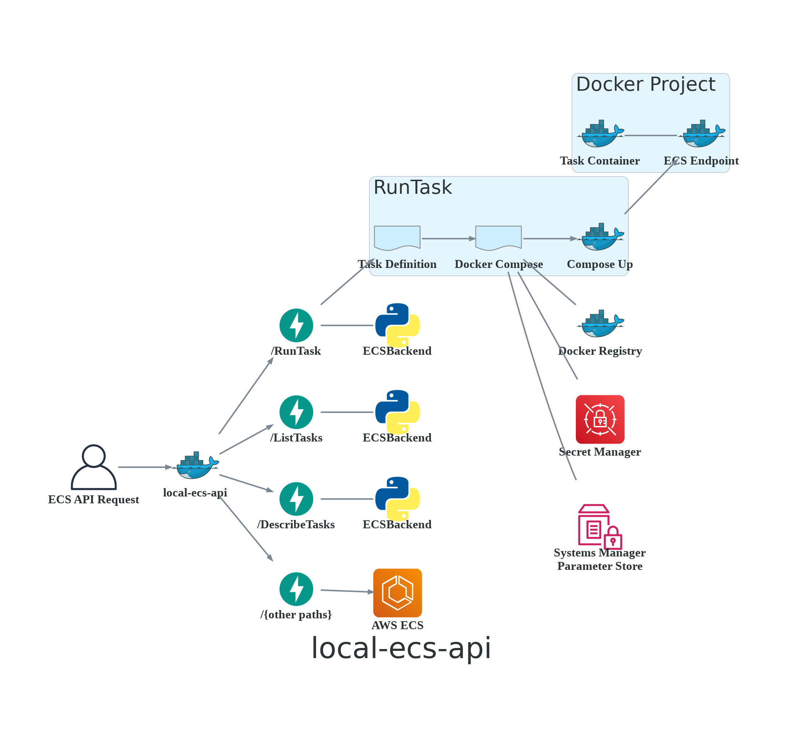

# ECS Run Task Local API

Docker image that can be used to test ECS tasks on a local machine. The container will convert the ECS task definition to a docker-compose file, run `docker compose up` and translate docker attributes into the appropriate ECS API response.

## Configurable Environment Variables:

All of the following environment variables are optional and are used to configure how the local-ecs-api will interact with external AWS endpoints.

- `ECS_ENDPOINT_URL`: Custom endpoint for ECS requests made within the local API. This endpoint URL will be used for redirecting any ECS requests that are not supported by this API and for retrieving the task definition to be converted into docker compose files.

- `ECS_ENDPOINT_AWS_REGION`: AWS region used within ECS endpoint

- `ECS_EXTERNAL_NETWORKS`: List of pre-existing docker networks to connect ECS endpoint and ECS task containers to delimited by "," (e.g. ECS_EXTERNAL_NETWORKS=network-bar,network-foo)

- `COMPOSE_DEST` (default: `/tmp`): The directory where task definition conversion to compose files should be stored

- `IAM_ENDPOINT`: Custom IAM endpoint the local ECS endpoint container will use for retrieving task AWS credentials

- `STS_ENDPOINT`: Custom STS endpoint used for:
   -  Retrieving AWS execution role credentials within local-ecs-api container
   -  Retrieving AWS task credentials within the local ECS endpoint container

- `SECRET_MANAGER_ENDPOINT_URL`: Custom Secret Manager endpoint used to retrieve secrets specified within the task definition to load into containers

- `SSM_ENDPOINT_URL`: Custom Systems Manager endpoint used to retrieve secrets specified within the task definition to load into containers

The local-ecs-api needs AWS permissions to fulfill RunTask API calls. See the Credentials Requirements section for more details. The credentials can be passed via:

A:
   - `AWS_ACCESS_KEY_ID`: AWS access key used for assuming task execution role and getting task definition
   - `AWS_SECRET_ACCESS_KEY`: AWS secret access key used for assuming task execution role and getting task definition

B:
   - `AWS_PROFILE`: [AWS profile](https://docs.aws.amazon.com/cli/latest/userguide/cli-configure-profiles.html) name


To configure how the ECS endpoint will retrieve the credentials to vend to task containers, one group of the following environment variables needs to be set. The permissions associated with the credentials have to be able to assume any IAM role that the task containers may need.

A:
   - `ECS_ENDPOINT_AWS_PROFILE`: [AWS profile](https://docs.aws.amazon.com/cli/latest/userguide/cli-configure-profiles.html) name
   - `AWS_CREDS_HOST_PATH`: Path to the `.aws/` credentials directory within the host machine. 
   - `ECS_AWS_CREDS_VOLUME_NAME` [OPTIONAL] (default: `ecs-local-aws-creds-volume`): Name of the docker volume that will mount the `AWS_CREDS_HOST_PATH` path to the ECS endpoint container

B:
   - `ECS_ENDPOINT_AWS_ACCESS_KEY_ID`: AWS access key
   - `ECS_ENDPOINT_AWS_SECRET_ACCESS_KEY`: AWS secret access key

## Credentials Requirements

The local-ecs-api container also simulates the ECS container agent used for running ECS tasks. This means that the container needs the appropriate AWS credentials to assume any ECS task execution roles that are given. In addition, the credentials need the following permissions specifically for RunTask API calls:

```
{
    "Version": "2012-10-17",
    "Statement": [
        {
            "Effect": "Allow",
            "Action": "ecs:DescribeTaskDefinition",
            "Resource": "*"
        }
    ]
}
```

## Example Usage

For running in a local environment using other local services (e.g. LocalStack or Moto container):

`docker-compose.yml`:

```
version: '3.4'
services:
  moto:
    image: motoserver/moto:4.0.1
    ports:
    - 5000:5000
    networks:
      local-ecs-api-tests:
  local-ecs-api:
    build: ../../
    image: marshall7m/local-ecs-api:latest
    restart: always
    volumes:
    - /usr/bin/docker:/usr/bin/docker
    - /var/run/docker.sock:/var/run/docker.sock
    ports:
    - 8000:8000
    environment:
    - COMPOSE_DEST

    - IAM_ENDPOINT=${MOTO_ENDPOINT_URL}
    - STS_ENDPOINT=${MOTO_ENDPOINT_URL}
    - ECS_ENDPOINT_URL=${MOTO_ENDPOINT_URL}
    - SSM_ENDPOINT_URL=${MOTO_ENDPOINT_URL}
    - SECRET_MANAGER_ENDPOINT_URL=${MOTO_ENDPOINT_URL}

    - AWS_ACCESS_KEY_ID=mock
    - AWS_SECRET_ACCESS_KEY=mock
    - AWS_DEFAULT_REGION=us-east-1

    - ECS_AWS_CREDS_VOLUME_NAME
    - ECS_ENDPOINT_AWS_PROFILE
    - AWS_CREDS_HOST_PATH

    - ECS_ENDPOINT_AWS_ACCESS_KEY_ID
    - ECS_ENDPOINT_AWS_SECRET_ACCESS_KEY

    networks:
      local-ecs-api-tests:

networks:
  local-ecs-api-tests:
    name: ${NETWORK_NAME}
    driver: bridge
    ipam:
      driver: default
```

Within the `app` container, AWS ECS API calls can be directed to the
`local-ecs-api` container like so:

Python via boto3 client:
```
import boto3
import os

ecs = boto3.client("ecs", endpoint_url="http://local-ecs-api:8000"

ecs.run_task(taskDefinition="arn:aws:ecs:us-west-2:123456789012:task-definition/foo:1")
```

AWS CLI:
```
aws ecs run-task --cluster default --task-definition foo:1 --endpoint-url http://local-ecs-api:8000
```

## Design
 


## Response Translation

The following ECS responses will contain attributes that reference the local docker compose project

`RunTask`
```
{
   "failures": [ 
      { 
         "arn": <docker>,
         "detail": <docker compose up stderr>,
         "reason": <docker compose up stderr translated to ecs reason>
      }
   ],
   "tasks": [ 
      { 
         "attachments": [ 
            { 
               "details": [ 
                  { 
                     "name": "string",
                     "value": "string"
                  }
               ],
               "id": "string",
               "status": "string",
               "type": "string"
            }
         ],
         "attributes": [ 
            { 
               "name": "string",
               "targetId": "string",
               "targetType": "string",
               "value": "string"
            }
         ],
         "availabilityZone": <AWS region parsed from task definition ARN>,
         "capacityProviderName": "string",
         "clusterArn": <uses `cluster` argument from RunTask request>,
         "connectivity": "string",
         "connectivityAt": number,
         "containerInstanceArn": "string",
         "containers": [ 
            { 
               "containerArn": <uses local docker container ID>,
               "cpu": <gets from task definition or RunTask overrides>,
               "exitCode": <gets from docker container inspect>,
               "gpuIds": [ "string" ],
               "healthStatus": <gets from docker container inspect>,
               "image": <gets from docker container inspect>,
               "imageDigest": <gets from docker container inspect>,
               "lastStatus": <gets from docker container inspect>,
               "managedAgents": [ 
                  { 
                     "lastStartedAt": number,
                     "lastStatus": "string",
                     "name": "string",
                     "reason": "string"
                  }
               ],
               "memory": <gets from task definition or RunTask overrides>,
               "memoryReservation": "string",
               "name": <gets from docker container inspect>,
               "networkBindings": [ 
                  { 
                     "bindIP": "string",
                     "containerPort": number,
                     "hostPort": number,
                     "protocol": "string"
                  }
               ],
               "networkInterfaces": [ 
                  { 
                     "attachmentId": "string",
                     "ipv6Address": "string",
                     "privateIpv4Address": "string"
                  }
               ],
               "reason": <gets from docker container inspect>,
               "runtimeId": <gets from docker container inspect>,
               "taskArn": <gets from docker container inspect>,
            }
         ],
         "cpu": <gets from task definition or RunTask overrides>,
         "createdAt": number,
         "desiredStatus": "string",
         "enableExecuteCommand": <gets from RunTask request>,
         "ephemeralStorage": { 
            "sizeInGiB": number
         },
         "executionStoppedAt": number,
         "group": "string",
         "healthStatus": <see local_ecs_api.models.task_health_status()>,
         "inferenceAccelerators": [ 
            { 
               "deviceName": "string",
               "deviceType": "string"
            }
         ],
         "lastStatus": <gets from docker compose ps>,
         "launchType": <gets from RunTask request>,
         "memory": <gets from task definition or RunTask overrides>,
         "overrides": <gets from RunTask request>,
         "platformFamily": <gets from running docker compose ps on local-ecs-endpoint's project>,
         "platformVersion": "string",
         "pullStartedAt": number,
         "pullStoppedAt": number,
         "startedAt": number,
         "startedBy": <gets from RunTask request>,
         "stopCode": <docker compose up return code>,
         "stoppedAt": number,
         "stoppedReason": <TODO>,
         "stoppingAt": number,
         "tags": <gets from RunTask request>,
         "taskArn": <interpolates docker compose project ID as task ID>,
         "taskDefinitionArn": <gets from RunTask request>,
         "version": number
      }
   ]
}
```
`DescribeTask`
(same as `RunTask`)

`ListTasks`
```
{
    'taskArns': <Task ARNs retreived from ECSBackend class>,
}
```

## Notes on ECS_CONTAINER_METADATA_URI

Within a remote AWS environment, the ECS container agent provides an [endpoint](https://docs.aws.amazon.com/AmazonECS/latest/developerguide/task-metadata-endpoint.html) for retrieving task metadata and Docker stats. The `amazon/amazon-ecs-local-container-endpoints` docker image used within this project simulates the endpoint locally. The local endpoint provides the [V3](https://docs.aws.amazon.com/AmazonECS/latest/developerguide/task-metadata-endpoint-v3.html) response metadata exclusively. 

It would seem like using the endpoint response would be ideal for crafting the RunTask and DescribeTask API response. Unfortunately, the endpoint does not update the metadata to reflect the current status of the task containers. For example, if a task container is running, the endpoint will correctly return a `KnownStatus` attribute of `RUNNING`. If the endpoint was hit again after the container task was finished, the response will still return a `KnownStatus` attribute of `RUNNING` when the expected value is `STOPPED`. To work around this, the local-ecs-api container will run the appropriate docker CLI command to extract the needed values for the ECS response. 

## TODO

- [ ] Handle RunTask request that fail on pulling container images
    - associated container should not be in failures attribute
- [ ] Add the following to the to DescribeTasksResponse
    - [ ] `attributes`
    - [ ] `capacityProviderName` (remove for Fargate tasks)
    - [ ] `containerInstanceArn` (remove for Fargate tasks)
    - [ ] `ephemeralStorage`
    - [ ] `inferenceAccelerators`
    - [ ] `platformVersion`
    - [ ] `startedBy` (remove if RunTask request doesn't include attribute)
    - [ ] `stoppedReason`
    - [ ] `version`
- [ ] add to `attachments` response attr
- Add values for attr when task is still running:
    - [ ] `stop_code`
    - [ ] `stopped_reason`
    - [ ] `execution_stopped_at`
    - [ ] `stopping_at`

- add pydantic validation for request that are fargate
    - require cpu, memory, etc
    - if launchType == "FARGATE" then ensure capacityProviderStrategy is not set
- add group attribute to describeTasks response